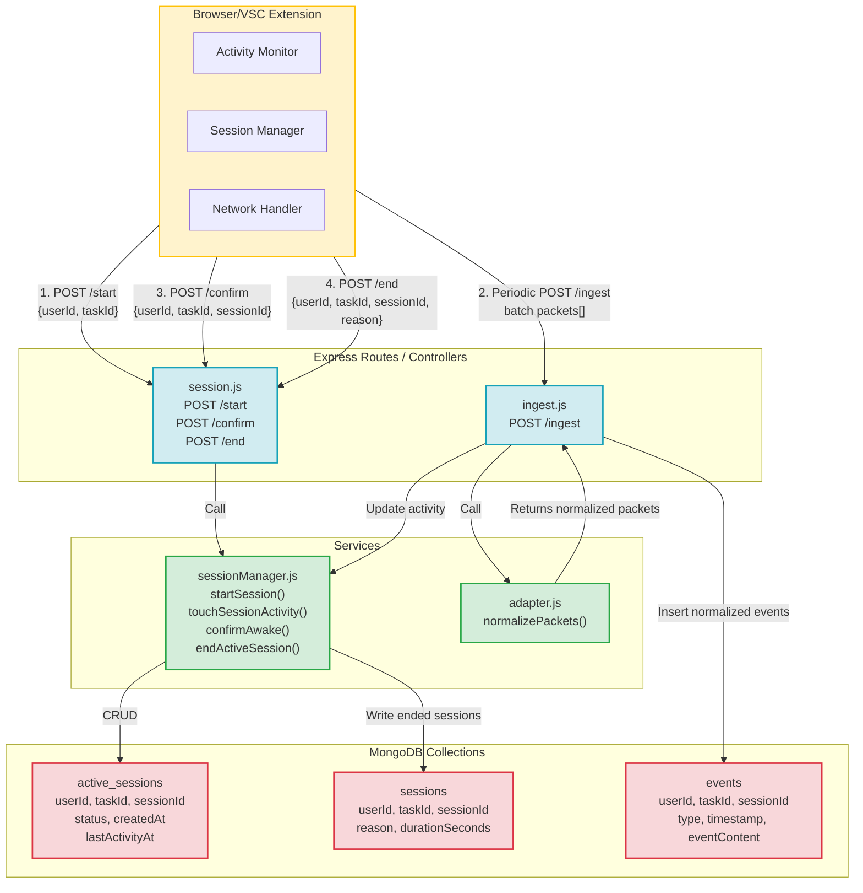
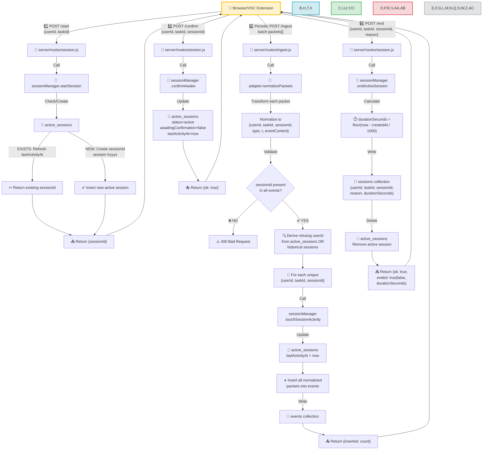
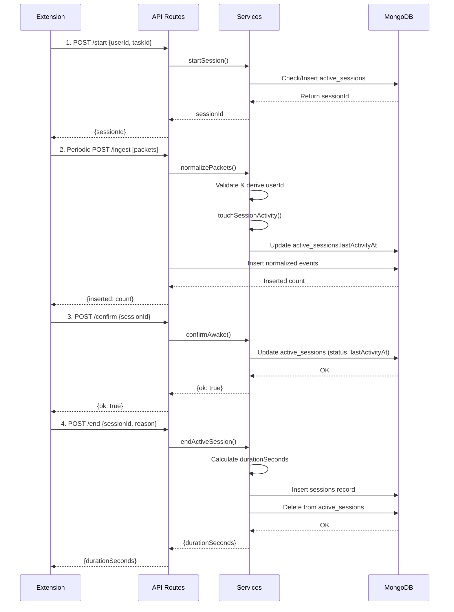

# Architecture Overview - VSC Extension Backend

This document provides a comprehensive architecture overview of how the browser/VSC extension integrates with the server backend for activity tracking and session management.

---

## System Architecture Diagram



---

## Detailed Flow Diagram



---

## Key Components

### 1. **Browser/VSC Extension** 
- **Activity Monitor**: Tracks user interactions and generates activity packets
- **Session Manager**: Manages session lifecycle (start, keep-alive, end)
- **Network Handler**: Communicates with backend via HTTP POST requests

### 2. **Express Routes**

#### `session.js`
- **POST /start**: Initiates a new session or refreshes an existing one
- **POST /confirm**: Confirms extension is still active (keep-alive ping)
- **POST /end**: Terminates an active session

#### `ingest.js`
- **POST /ingest**: Receives batch activity packets for ingestion

### 3. **Business Logic Services**

#### `sessionManager.js`
| Method | Purpose |
|--------|---------|
| `startSession()` | Creates or refreshes active session in MongoDB |
| `touchSessionActivity()` | Updates lastActivityAt timestamp |
| `confirmAwake()` | Confirms session is active and updates status |
| `endActiveSession()` | Calculates duration and archives session |

#### `adapter.js`
| Method | Purpose |
|--------|---------|
| `normalizePackets()` | Transforms raw extension packets into standardized event format |

### 4. **MongoDB Collections**

#### `active_sessions`
```json
{
  "userId": "string",
  "taskId": "string",
  "sessionId": "string (session-Xyyyz)",
  "status": "active|inactive",
  "createdAt": "timestamp",
  "lastActivityAt": "timestamp",
  "awaitingConfirmation": "boolean",
  "pingStartedAt": "timestamp (optional)"
}
```

#### `sessions`
```json
{
  "userId": "string",
  "taskId": "string",
  "sessionId": "string",
  "reason": "string (default: 'ended')",
  "durationSeconds": "number",
  "createdAt": "timestamp",
  "endedAt": "timestamp"
}
```

#### `events`
```json
{
  "userId": "string",
  "taskId": "string",
  "sessionId": "string",
  "type": "string",
  "timestamp": "number (t field)",
  "eventContent": "object",
  "metrics": "object (optional)"
}
```

---

## Activity Flow Summary

| Step | Action | Input | Output | DB Operation |
|------|--------|-------|--------|--------------|
| **1. Start** | Create/refresh session | `{userId, taskId}` | `{sessionId}` | Insert/Update `active_sessions` |
| **2. Ingest** | Process activity packets | `batch packets[]` | `{inserted: count}` | Insert `events`; Update `active_sessions.lastActivityAt` |
| **3. Confirm** | Keep-alive ping | `{userId, taskId, sessionId}` | `{ok: true}` | Update `active_sessions.lastActivityAt` |
| **4. End** | Close session | `{userId, taskId, sessionId, reason}` | `{durationSeconds}` | Insert `sessions`; Delete from `active_sessions` |

---

## Data Flow Sequence



---

## Error Handling

| Scenario | Status Code | Response |
|----------|------------|----------|
| Missing `sessionId` in ingest packets | `400` | Error message: sessionId required |
| Duplicate active session | `200` | Return existing `sessionId` |
| Unknown userId in ingest | `200` | Lookup from `active_sessions` or historical `sessions` |
| Session not found on end | `200` | `ended: false` |

---

## Implementation Notes

- **Session ID Format**: `session-Xyyyz` where `X` and `y`, `z` are alphanumeric identifiers
- **Activity Heartbeat**: Updated on every ingest batch for continuous session tracking
- **AFK Handling**: Extension confirms it's still active via `/confirm` endpoint
- **Duration Calculation**: Server-side, based on timestamps stored in MongoDB
- **Atomic Operations**: Session start checks for existing sessions to prevent duplicates
